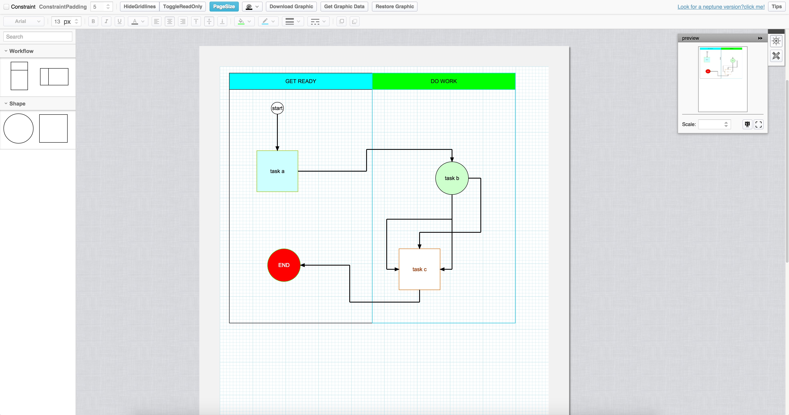
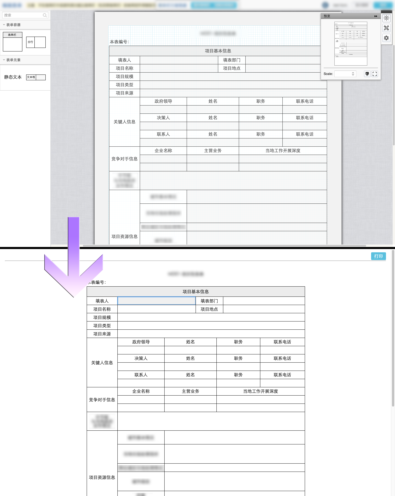
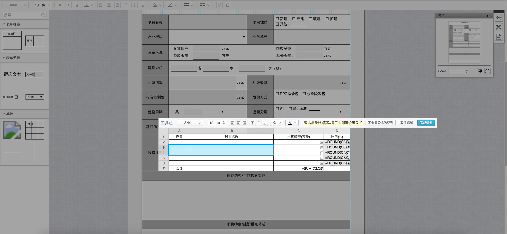
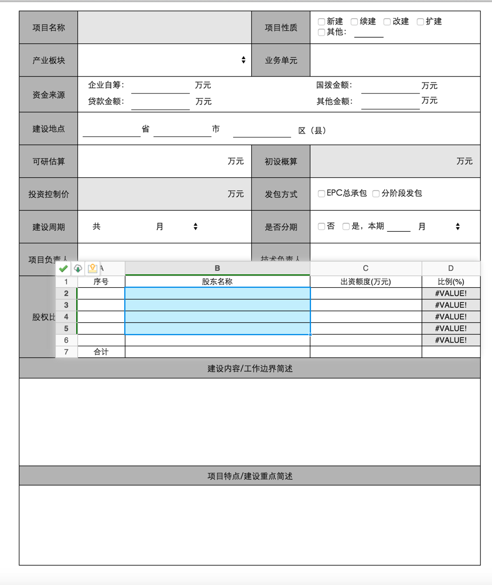

GraphicDesigner
===============
a graphic designer developed by extjs4/jquery/raphael.high customizable view bevaviors(delegates)

Hi,everyone.im a web/java/ios developer from China.
recently im developing a Graphic Designer based on ExtJs4.2.x&jQuery&raphael.i think it's a very common thing and 
there're lots of familiar designers throughout the web.
But,u really should look at this,it's very friendly with ur BUSINESS!
    
	> Wanna build an Online Visio Application?
	>Yes,ITSELF is!

	> Wanna draw a Workflow Template?
	>It provides complex validations by extra!

	> Wanna build up a form designer?
	>It can do it excellently!(you can not only find a form designer here,
		but also a "Design Draft->Real Form" instance here!)
  
Graphic Designer has a well-designed mechanism of 'DELEGATE(like plugin)',
when you wanna add new behaviors to a view(i.e. circle/rect/text/path and so on),just write a customized delegate for it,and wire it with the view as you wish!
  
It's a world of delegates!

Here snapshots go>>>>>!

Overview
---------

Form Designer->Real Form!
---------

Form Designer with an excel editor!
---------

[Online Demo](http://dicolar.github.io/GraphicDesigner/demos/overview.html)

But,there're still some known issues(small issues) on it,and it's now at version 0.1.0-beta.
You can watch this project, any suggestion is appreciated!
Please give me a star if you like this project!

Update log
-----------

>2015-09-14
>
>bravo!style bar completed!
>multi selection's performance has improved,more efficient!(& bug fixed)

>2015-09-08
>
>yes! linkers now can b adjusted!
>linker arrow can be re dragged!
>multi selection model has some problem,workin on it!

>2015-09-05
>
>cheers! linker algrithm is completed!
>multi selection model is now available

i will attach develop document soon...
